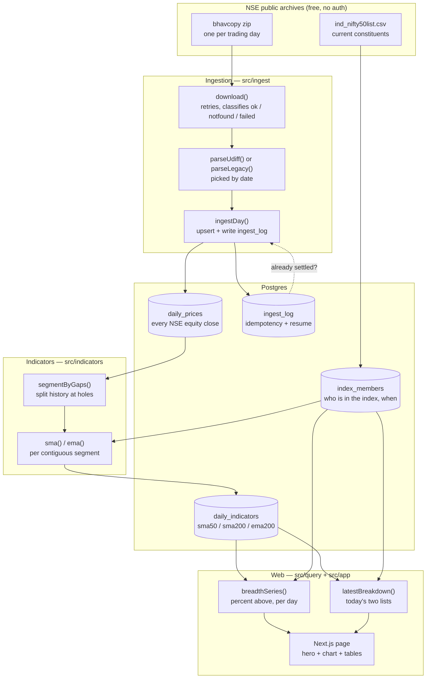
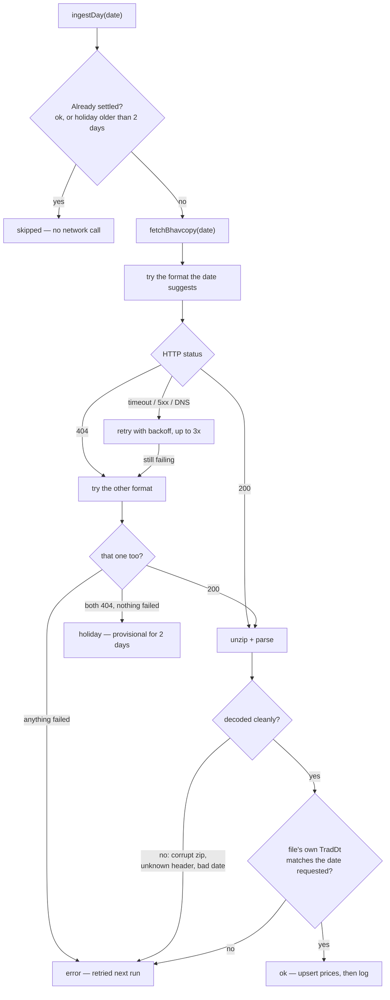
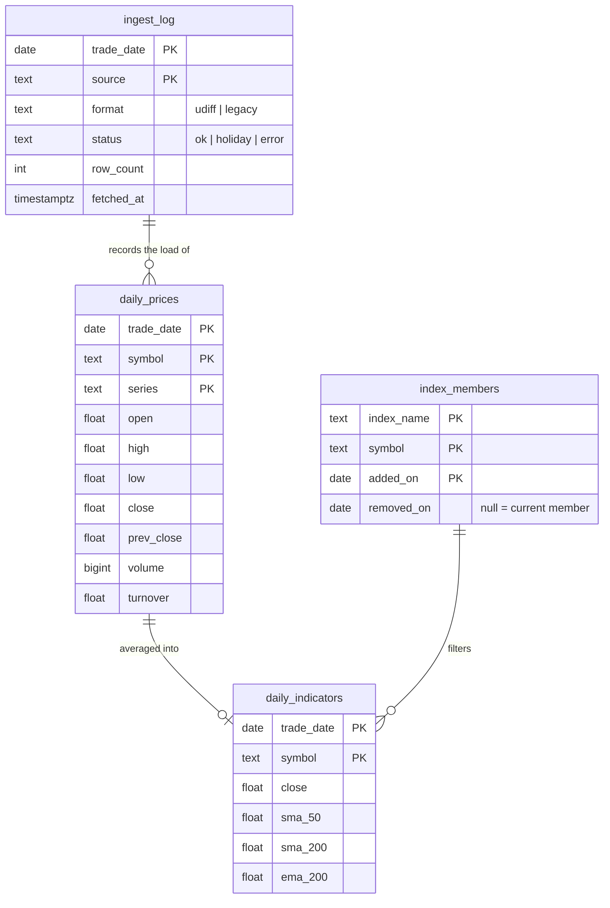

# tradeSence

**NIFTY 50 market-breadth tracker.** It answers one question every evening: *how many
NIFTY 50 constituents are trading above their long-term moving average?* — and charts
that percentage over ten years.

A single reading is meaningless on its own. "30% of the index is above its 200-day
average" could be a panic low or an ordinary Tuesday. The ten years of history are what
turn it into a signal:

> **Example (25 Sep 2026):** breadth was **30%**, which sits at the **6.8th percentile**
> of 2,269 sessions. Only ~7% of the last decade has been this weak. The ten-year average
> is 63%. The only worse stretches were March–June 2020 and February–March 2025.

Data comes from **free, public NSE bhavcopy archives**. No broker account, no API key,
no subscription, no authentication anywhere in the codebase.

---

## How it works



**The core design principle is "store everything, filter at query time."** Bhavcopy
contains the whole NSE cash market and we download the entire file regardless, so
`daily_prices` keeps all of it. "NIFTY 50" is just rows in `index_members`, joined at
query time. Switching to NIFTY 500 — or fixing the survivorship caveat below — is a
query change, never a re-download.

### How a single day is classified

This decision tree is the heart of the system. Getting it wrong is how a pipeline ends
up with silent, permanent holes.



Three rules encoded above, each learned the hard way:

- **A 404 is not proof of a holiday.** NSE returns 404 for a file that has not been
  published *yet*, identically to one that will never exist. So `holiday` stays
  provisional for two days; otherwise a cron running before NSE publishes would cache a
  real trading day as a holiday **forever**.
- **`error` is never "settled".** A transient network blip must be retried on the next
  run. Collapsing failures into `holiday` writes a permanent hole nothing ever corrects.
- **Prices are written before the log, deliberately, with no transaction.** Dying between
  the two leaves no log row, so the next run re-upserts harmlessly. The reverse order
  could record a day as `ok` with no prices behind it — an error nothing would detect.

### Database schema



Breadth itself is **a query, not a table** — the percentage is computed on read.

---

## Setup

```bash
brew services start postgresql@14
createdb tradesence && createdb tradesence_test

bun install
bun run db:migrate
DATABASE_URL=postgres://localhost:5432/tradesence_test bun run db:migrate
```

`DATABASE_URL` lives in `.env` and defaults to `postgres://localhost:5432/tradesence`.

## Load data

```bash
bun run ingest:nifty50 2016-09-01               # seed index membership
bun run ingest:backfill 2016-09-28 2026-09-25   # ~2,600 files, ~28 min, ~250 MB
bun run indicators                              # compute all moving averages (~5s)
bun run dev                                     # http://localhost:3000
```

## Running it

Start the database first, then the server:

```bash
# Database (Homebrew Postgres 14)
brew services start postgresql@14     # start, and restart at login
brew services stop postgresql@14      # stop
brew services list | grep postgresql  # is it running?
psql tradesence                       # open a SQL shell on the dev database

# Server
bun run dev                           # dev server with hot reload, http://localhost:3000
bun run build && bun run start        # production build, served on :3000
```

To run on another port, use `bun run dev -- -p 3001`. The page queries Postgres on every
request, so if the database is down the server still starts but the page fails to load.

## Keep it current

```bash
./ops/install-nightly.sh                                    # install / reinstall
launchctl kickstart gui/$(id -u)/com.tradesence.nightly     # run it now
launchctl print gui/$(id -u)/com.tradesence.nightly | grep "last exit"
tail ~/Library/Logs/tradesence-nightly.log                  # output of each run
launchctl bootout gui/$(id -u)/com.tradesence.nightly       # uninstall
```

This installs a launchd agent (`ops/com.tradesence.nightly.plist`) that runs
`ingest:nightly` Mon–Fri at 19:30 local time, after NSE publishes. It uses launchd rather
than cron because a run missed while the Mac is asleep fires on wake. `ingest:nightly`
re-ingests the last 7 days and recomputes, and every step is idempotent, so a night
missed while the Mac was off heals on the next run. Postgres must be running (`brew
services` starts it at login). Re-run the installer if you move the repo or reinstall bun.

---

## Commands

| Command | What it does |
|---|---|
| `brew services start postgresql@14` | Start the database |
| `brew services stop postgresql@14` | Stop the database |
| `bun run dev` | Next.js dashboard on :3000 |
| `bun run build && bun run start` | Production build and server on :3000 |
| `bun test` | Full suite (78 tests; always uses `tradesence_test`) |
| `bun test tests/breadth.test.ts` | One file |
| `bun test --test-name-pattern "idempotent"` | One test by name |
| `bun run db:generate` | Schema change → migration file |
| `bun run db:migrate` | Apply migrations |
| `bun run db:studio` | Browse the data |
| `bun run ingest:nifty50 <date>` | Seed/replace NIFTY 50 membership |
| `bun run ingest:day <date> [--force]` | Ingest one session |
| `bun run ingest:backfill <start> <end>` | Ingest a date range, resumable |
| `bun run indicators` | Recompute every moving average |
| `bun run ingest:nightly` | Cron entry point: ingest recent days + recompute |

---

## Function reference

### `src/ingest/bhavcopy.ts` — fetching and parsing NSE files

| Function | Signature | Notes |
|---|---|---|
| `parseUdiff` | `(csv: string) => BhavRow[]` | Parses the modern (2024→) format. Validates **all ten** columns it reads, keeps only `EQ`/`BE` series, drops rows without a usable close. |
| `parseLegacy` | `(csv: string) => BhavRow[]` | Same for the pre-2024 format. Converts `DD-MON-YYYY` **and** `DD-MON-YY` timestamps. |
| `bhavcopyUrl` | `(dateIso: string) => { url, format }` | Picks the format from the date. Cutover at `UDIFF_START` (2024-01-01), which sits inside the verified overlap between the two formats. |
| `download` | `(url, { retries?, timeoutMs?, backoffMs? }) => Promise<DownloadResult>` | Returns `ok` / `notfound` / `failed`. Retries `failed` with linear backoff; never retries a 404, which is a definite answer. |
| `fetchBhavcopy` | `(dateIso, { download? }) => Promise<FetchResult>` | Tries both formats, decodes inside the error guard. Returns `ok` / `holiday` / `error`. The `download` parameter exists so tests can inject a corrupt payload. |

Internal helpers: `splitLines`, `num` (returns `NaN`, not `0`, for unparseable input),
`hasUsablePrices`, `requireHeader`, `requireIsoDate`, `legacyDateToIso`, `udiffUrl`,
`legacyUrl`, `unzipCsv`.

Exported types: `BhavFormat`, `BhavRow`, `FetchResult`, `DownloadResult`, `UDIFF_START`.

### `src/ingest/ingest-day.ts` — persisting one session

| Function | Signature | Notes |
|---|---|---|
| `ingestDay` | `(dateIso, { force? }) => Promise<IngestResult>` | Fetch → validate → upsert → log. Idempotent twice over: settled days short-circuit, and the write is an upsert. |
| `isSettled` | `(dateIso: string) => Promise<boolean>` | `ok` always settled; `holiday` only after a 2-day grace; `error` never. |
| `assertDateMatches` | `(dateIso, rows: BhavRow[]) => boolean` | Guards against the file reporting a different `TradDt` than the date requested. |

Internal: `writeLog`, `upsertPrices` (chunked at 1,000 rows — 10 columns keeps it under
Postgres's 65,535 bind-parameter cap).

### `src/ingest/backfill.ts` — ingesting a range

| Function | Signature | Notes |
|---|---|---|
| `weekdaysBetween` | `(startIso, endIso) => string[]` | Every weekday in an inclusive range, computed in UTC so a DST shift cannot drop a day. Skips weekends (~30% fewer requests); exchange holidays are left to the 404 path. |
| `backfill` | `(startIso, endIso, { delayMs?, onProgress?, ingest? }) => Promise<Tally>` | Oldest-first, rate-limited, resumable. Wraps each day in a guard so no single failure — network *or* database — can end the run. |

### `src/ingest/nifty50.ts` — index membership

| Function | Signature | Notes |
|---|---|---|
| `fetchNifty50Symbols` | `() => Promise<string[]>` | The 50 current constituents from NSE's published CSV. |
| `seedNifty50` | `(addedOn: string) => Promise<number>` | **Replaces** open intervals rather than adding to them — the primary key includes `added_on`, so a second seed at a different date would otherwise double every count. |

### `src/indicators/moving-average.ts` — the maths

| Function | Signature | Notes |
|---|---|---|
| `sma` | `(values: number[], period) => (number \| null)[]` | Simple average. Returns an array the **same length** as the input, `null`-padded, so index alignment with dates is never lost. |
| `ema` | `(values: number[], period) => (number \| null)[]` | Exponential average, `k = 2/(period+1)`, seeded with the SMA of the first `period` values. Each value depends on the previous, so it cannot be a SQL window function. |

### `src/indicators/compute.ts` — writing indicators

| Function | Signature | Notes |
|---|---|---|
| `segmentByGaps` | `(dates: string[], maxGapDays = 21) => number[][]` | Splits a series at holes. Without it, a partially loaded history would average 2018 closes with 2024 closes and write the result out as an ordinary non-null number. |
| `computeIndicators` | `(indexName = "NIFTY50") => Promise<number>` | Recomputes every average for every member, per contiguous segment. Cheap enough (~5s for 113k rows) that there is no incremental path to get subtly wrong. |

### `src/query/breadth.ts` — the two questions the page asks

| Function | Signature | Notes |
|---|---|---|
| `breadthSeries` | `(ma: MaKind, indexName?) => Promise<BreadthPoint[]>` | Percent above, per trading day, over all history. Membership is evaluated **per date**, so correct point-in-time data would give point-in-time breadth with no code change. Symbols whose average is still null are excluded, not counted as "below". |
| `latestBreakdown` | `(ma: MaKind, indexName?) => Promise<{ date, above, below }>` | The newest session split into two ranked lists with each symbol's percentage distance from its average. |

Exports `MA_COLUMNS`, `MA_LABELS`, and types `MaKind`, `BreadthPoint`, `MemberRow`.

### `src/db/` — schema and connection

| Function | Signature | Notes |
|---|---|---|
| `resolveDatabaseUrl` | `(env?) => string` | Refuses to hand a non-`_test` database to a run with `NODE_ENV=test`. This guard lives at the connection point because `bun test` resolves `bunfig.toml` from the **cwd** — run from a subdirectory the preload never fires, and the suite's `db.delete` calls would hit the dev database. |

`schema.ts` exports the four tables; `index.ts` exports `db`, `sql`, `schema`.

### `src/app/` and `src/components/` — the page

| Component | Notes |
|---|---|
| `Page` | Server component. Reads `?ma=` and validates it with `isMaKind` — three strict comparisons, which is what keeps the one `sql.raw` call in the codebase safe. |
| `BreadthChart` | Client component (Recharts). Single series, so no legend — the heading names it. Crosshair tooltip, 50% reference line. |
| `MemberTable` | Renders one ranked list; shades rows within 2% of their average — the names most likely to flip next. |

---

## NSE facts that cost time to rediscover

- **Two file formats.** UDiFF (`BhavCopy_NSE_CM_0_0_0_YYYYMMDD_F_0000.csv.zip`) serves
  2024-01-02→now; legacy (`.../EQUITIES/YYYY/MON/cmDDMONYYYYbhav.csv.zip`) serves up to
  ~2024-06. They overlap, and the fetcher falls back between them.
- **Holidays return HTTP 404 with a ~3.4 KB body.** A non-empty response proves nothing —
  check the status code, then validate the header row.
- **Legacy files sometimes carry a two-digit year.** 2020-07-13 ships as `13-JUL-20`.
  Parsing that naively yields year 20 AD, which Postgres rejects mid-backfill.
- **Bhavcopy dates are honest** (`TradDt` matches the URL date). NSE's *52-week high/low*
  file is **not** — the file labelled day D holds data through D−1. Not used here, but
  remember it if you add that source.
- Prices are **unadjusted** for splits and bonuses, so a split shows as a price gap that
  briefly distorts that symbol's average.

## Testing

78 tests. `bunfig.toml` preloads `tests/setup.ts`, and `resolveDatabaseUrl` enforces the
same rule at the connection point so no invocation path can reach the dev database.

Network tests hit the live NSE archive deliberately: it is public, and it is the thing
most likely to break — mocking it would only prove the mock works.

## Known limitation

The ten-year chart is **survivorship-biased**. `index_members` is seeded with *today's*
50 names over one open interval, so historical breadth is computed on today's winners and
reads slightly optimistically. The schema already supports real point-in-time membership
(`added_on` / `removed_on`); populating it needs a constituent-history source — NSE's own
`IndexInclExcl.xls` is stale with effectively nothing after ~2015, so use
niftyindices.com monthly archives or niftyhistory.in. **Fixing it requires no re-ingest.**
