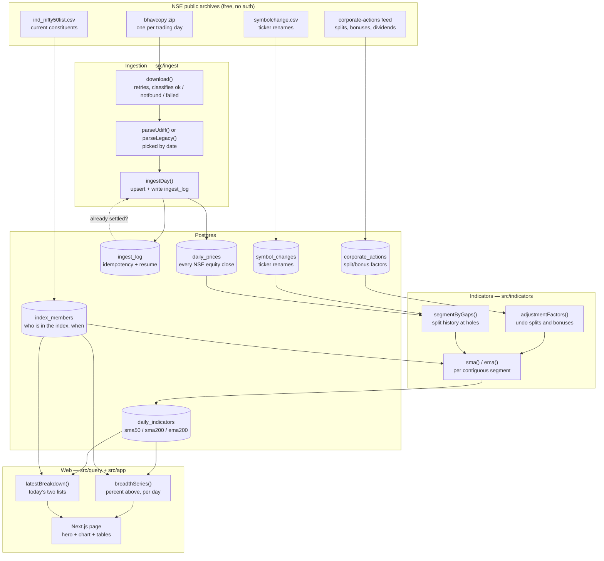
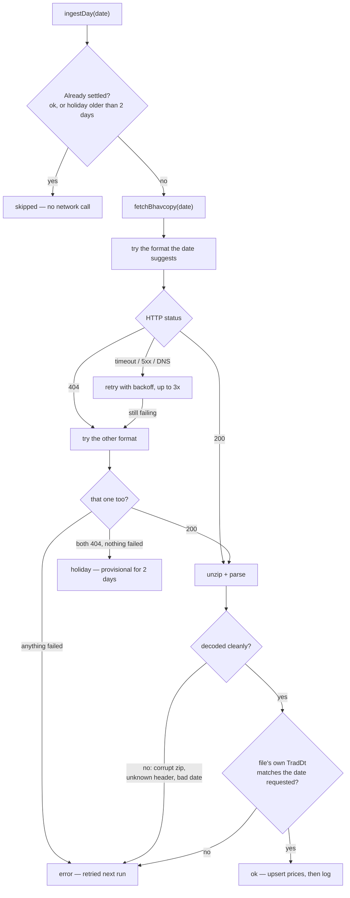
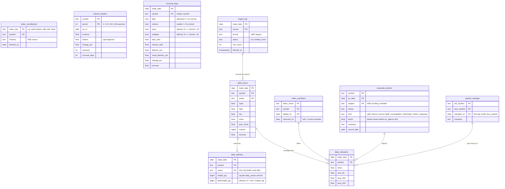

# tradeSence

**NIFTY 50 market-breadth tracker.** It answers one question every evening: *how many
NIFTY 50 constituents are trading above their long-term moving average?* — and charts
that percentage since 2020, using the index's **real** membership on each day.

A single reading is meaningless on its own. "30% of the index is above its 200-day
average" could be a panic low or an ordinary Tuesday. The history is what turns it into
a signal:

> **Example (25 Sep 2026):** breadth was **32%**, which sits at the **12.6th percentile**
> of 1,670 sessions since 2020: only about one session in eight has been this weak. The
> average since 2020 is 64.5%.

Data comes from **free, public NSE bhavcopy archives**. No broker account, no API key,
no subscription, no authentication anywhere in the codebase.

---

## How it works



**The core design principle is "store everything, filter at query time."** Bhavcopy
contains the whole NSE cash market and we download the entire file regardless, so
`daily_prices` keeps all of it. "NIFTY 50" is just rows in `index_members`, joined at
query time. Switching to NIFTY 500 — or changing the membership history — is a
query change, never a re-download.

### How a single day is classified

This decision tree is the heart of the system. Getting it wrong is how a pipeline ends
up with silent, permanent holes.



Three rules encoded above, each learned the hard way:

- **A 404 is not proof of a holiday.** NSE returns 404 for a file that has not been
  published *yet*, identically to one that will never exist. So `holiday` stays
  provisional for two days; otherwise a cron running before NSE publishes would cache a
  real trading day as a holiday **forever**.
- **`error` is never "settled".** A transient network blip must be retried on the next
  run. Collapsing failures into `holiday` writes a permanent hole nothing ever corrects.
- **Prices are written before the log, deliberately, with no transaction.** Dying between
  the two leaves no log row, so the next run re-upserts harmlessly. The reverse order
  could record a day as `ok` with no prices behind it — an error nothing would detect.

### Database schema



Breadth itself is **a query, not a table** — the percentage is computed on read.

---

## Setup

```bash
brew services start postgresql@14
createdb tradesence && createdb tradesence_test

bun install
bun run db:migrate
DATABASE_URL=postgres://localhost:5432/tradesence_test bun run db:migrate
```

`DATABASE_URL` lives in `.env` and defaults to `postgres://localhost:5432/tradesence`.

## Load data

```bash
bun run ingest:nifty50                          # load NIFTY 50 membership since 2020 from the CSV
bun run ingest:members bank                     # load Nifty Bank membership since 2020 (any registered key: nifty50, bank, financial-services)
bun run ingest:symbol-changes                   # ticker renames (needed by the next steps)
bun run ingest:backfill 2016-09-28 2026-09-25   # ~2,600 files, ~28 min, ~250 MB
bun run ingest:corporate-actions 2016-01-01 2026-11-01  # splits/bonuses (~15s)
bun run ingest:symbol-changes                   # NSE ticker renames (one small file)
bun run indicators                              # compute all moving averages (~5s)
bun run dev                                     # http://localhost:3000
```

## Running it

Start the database first, then the server:

```bash
# Database (Homebrew Postgres 14)
brew services start postgresql@14     # start, and restart at login
brew services stop postgresql@14      # stop
brew services list | grep postgresql  # is it running?
psql tradesence                       # open a SQL shell on the dev database

# Server
bun run dev                           # dev server with hot reload, http://localhost:3000
bun run build && bun run start        # production build, served on :3000
```

To run on another port, use `bun run dev -- -p 3001`. The page queries Postgres on every
request, so if the database is down the server still starts but the page fails to load.

## Keep it current

```bash
./ops/install-nightly.sh                                    # install / reinstall
launchctl kickstart gui/$(id -u)/com.tradesence.nightly     # run it now
launchctl print gui/$(id -u)/com.tradesence.nightly | grep "last exit"
tail ~/Library/Logs/tradesence-nightly.log                  # output of each run
launchctl bootout gui/$(id -u)/com.tradesence.nightly       # uninstall
```

This installs a launchd agent (`ops/com.tradesence.nightly.plist`) that runs
`ingest:nightly` Mon–Fri at 19:30 local time, after NSE publishes. It uses launchd rather
than cron because a run missed while the Mac is asleep fires on wake. `ingest:nightly`
re-ingests the last 7 days and recomputes, and every step is idempotent, so a night
missed while the Mac was off heals on the next run. Postgres must be running (`brew
services` starts it at login). Re-run the installer if you move the repo or reinstall bun.

---

## Commands

Every data pipeline, how it runs and what is automated: [docs/pipelines.md](docs/pipelines.md).

| Command | What it does |
|---|---|
| `brew services start postgresql@14` | Start the database |
| `brew services stop postgresql@14` | Stop the database |
| `bun run dev` | Next.js dashboard on :3000 |
| `bun run build && bun run start` | Production build and server on :3000 |
| `bun test` | Full suite (78 tests; always uses `tradesence_test`) |
| `bun test tests/breadth.test.ts` | One file |
| `bun test --test-name-pattern "idempotent"` | One test by name |
| `bun run db:generate` | Schema change → migration file |
| `bun run db:migrate` | Apply migrations |
| `bun run db:studio` | Browse the data |
| `bun run ingest:nifty50` | Load NIFTY 50 membership since 2020 from `src/ingest/nifty50-history.csv` (same as `ingest:members nifty50`) |
| `bun run ingest:members <nifty50\|bank> [--force]` | Load one registered index's membership from its CSV ([0034](docs/decisions/0034-nifty-bank-true-membership.md)): replaces only that index's rows in one transaction; refuses a file that breaks the index's size schedule, and one with fewer rows than are stored unless `--force`. Manual only |
| `bun run ingest:corporate-actions <start> <end>` | Load NSE splits/bonuses/dividends for a range (one request per year) |
| `bun run ingest:symbol-changes` | Load NSE's full list of ticker renames |
| `bun run ingest:indices <start> <end>` | Load daily closes of every NSE index (resumable) |
| `bun run ingest:delivery <start> <end>` | Load delivered vs traded shares per stock (resumable) |
| `bun run db:backup` | Compressed `pg_dump` to `~/Backups/tradesence`, newest 7 kept (also nightly) |
| `bun run research:forward-returns` | Print the breadth forward-return study as Markdown |
| `bun run research:volume-market` | Print the whole-market volume study (research 0004); `-- --json file` writes the chart data; ~75 s |
| `bun run research:volume-or-jump` | Print research 0005 (heavy vs ordinary volume on same-size jumps; matched comparison + Fama–MacBeth); `-- --json file` writes the chart data; ~75 s |
| `bun run research:delivery` | Print the delivery study (research 0003) as Markdown; whole liquid market, about 2 minutes |
| `bun run research:fund-symbols` | Rebuild `src/research/fund-symbols.txt` (NSE ETFs since 2016, by ISIN); ~15 s |
| `bun run research:volume` | Print the volume study (research 0002) as Markdown; `-- --check SYM,SYM` prints the latest CMF/MFI |
| `bun run ingest:day <date> [--force]` | Ingest one session |
| `bun run ingest:backfill <start> <end>` | Ingest a date range, resumable |
| `bun run indicators` | Recompute every moving average |
| `bun run activity` | Rebuild the Unusual activity table (also nightly; ~20 s) |
| `bun run ingest:index-lists` | Download today's members of 43 NSE indices (also nightly; ~15 s) |
| `bun run volume-leaders` | Rebuild the Top volume table (also nightly; ~5 s) |
| `bun run money-flow` | Rebuild the Money flow table (also nightly; ~8 s) |
| `bun run breadth` | Whole-market and NSE index-list breadth into `breadth_daily`, upsert only (also nightly; ~20 s) |
| `bun run ingest:nightly` | Cron entry point: ingest recent days + recompute |

---

## Function reference

### `src/ingest/bhavcopy.ts` — fetching and parsing NSE files

| Function | Signature | Notes |
|---|---|---|
| `parseUdiff` | `(csv: string) => BhavRow[]` | Parses the modern (2024→) format. Validates **all ten** columns it reads, keeps only `EQ`/`BE` series, drops rows without a usable close. |
| `parseLegacy` | `(csv: string) => BhavRow[]` | Same for the pre-2024 format. Converts `DD-MON-YYYY` **and** `DD-MON-YY` timestamps. |
| `bhavcopyUrl` | `(dateIso: string) => { url, format }` | Picks the format from the date. Cutover at `UDIFF_START` (2024-01-01), which sits inside the verified overlap between the two formats. |
| `download` | `(url, { retries?, timeoutMs?, backoffMs? }) => Promise<DownloadResult>` | Returns `ok` / `notfound` / `failed`. Retries `failed` with linear backoff; never retries a 404, which is a definite answer. |
| `fetchBhavcopy` | `(dateIso, { download? }) => Promise<FetchResult>` | Tries both formats, decodes inside the error guard. Returns `ok` / `holiday` / `error`. The `download` parameter exists so tests can inject a corrupt payload. |

Internal helpers: `splitLines`, `num` (returns `NaN`, not `0`, for unparseable input),
`hasUsablePrices`, `requireHeader`, `requireIsoDate`, `legacyDateToIso`, `udiffUrl`,
`legacyUrl`, `unzipCsv`.

Exported types: `BhavFormat`, `BhavRow`, `FetchResult`, `DownloadResult`, `UDIFF_START`.

### `src/ingest/ingest-day.ts` — persisting one session

| Function | Signature | Notes |
|---|---|---|
| `ingestDay` | `(dateIso, { force? }) => Promise<IngestResult>` | Fetch → validate → upsert → log. Idempotent twice over: settled days short-circuit, and the write is an upsert. |
| `isSettled` | `(dateIso: string) => Promise<boolean>` | `ok` always settled; `holiday` only after a 2-day grace; `error` never. |
| `assertDateMatches` | `(dateIso, rows: BhavRow[]) => boolean` | Guards against the file reporting a different `TradDt` than the date requested. |

Internal: `writeLog`, `upsertPrices` (chunked at 1,000 rows — 10 columns keeps it under
Postgres's 65,535 bind-parameter cap).

### `src/ingest/backfill.ts` — ingesting a range

| Function | Signature | Notes |
|---|---|---|
| `weekdaysBetween` | `(startIso, endIso) => string[]` | Every weekday in an inclusive range, computed in UTC so a DST shift cannot drop a day. Skips weekends (~30% fewer requests); exchange holidays are left to the 404 path. |
| `backfill` | `(startIso, endIso, { delayMs?, onProgress?, ingest? }) => Promise<Tally>` | Oldest-first, rate-limited, resumable. Wraps each day in a guard so no single failure — network *or* database — can end the run. |

### `src/ingest/indices.ts` — the index registry (decisions 0034, 0037)

| Name | Signature | Notes |
|---|---|---|
| `INDICES`, `NIFTY50`, `NIFTY_BANK`, `NIFTY_FIN_SERVICE` | `IndexEntry { key, members, prices, list, label, term, file, sizes }` | One entry per index tracked on true membership, in default-card order: page key (`u`), `index_members` name, NSE's `index_prices` name, `INDEX_LISTS` key, label, its glossary entry, CSV, and the expected size by date. `IndexKey` is the union of the keys. Pure data. |
| `cleanIndex`, `isIndexKey` | `(v) => IndexEntry` / `(v) => v is IndexKey` | The pages' `u` param: a registered key, else the NIFTY 50; the strict key check (Unusual activity's `set`). |
| `indexByKey`, `sizeOn`, `uParam`, `membersPhrase`, `possessive`, `indexLabels` | | Lookup; size on a date; `""` or `"&u=bank"` for links; "Nifty Bank's 14 members"; "Nifty Financial Services'" (a name ending in s takes the apostrophe alone); "NIFTY 50, Nifty Bank or Nifty Financial Services". |
| `parseMembersArgs` | `(argv) => { entry, force } \| null` | `ingest:members`' arguments: exactly a registered key, then only `--force`; anything else is `null` (usage). |

### `src/ingest/membership-checks.ts` — nightly membership warnings

| Function | Signature | Notes |
|---|---|---|
| `membershipWarnings` | `(today, entries = INDICES) => Promise<string[]>` | Per index: the file vs NSE's list in `index_constituents` (only if fetched today, else "could not check"), and the file vs `index_members` ("edited but not loaded"). Never writes. |

### `src/ingest/nifty50.ts` — index membership

| Function | Signature | Notes |
|---|---|---|
| `fetchNifty50Symbols` | `() => Promise<string[]>` | The 50 current constituents from NSE's published CSV. Used only as the nightly cross-check of the membership file. |

### `src/ingest/nifty50-history.ts` — point-in-time membership

| Function | Signature | Notes |
|---|---|---|
| `parseMembershipHistory` / `readMembershipHistory` | `(text, label?) / (entry = NIFTY50) => MembershipRow[]` | Reads an index's CSV (`nifty50-history.csv`, `niftybank-history.csv`, `niftyfinservice-history.csv`). Throws on a bad date, a removal before an addition, or a wrong header — never skips a row. |
| `membersOn` | `(rows, date) => string[]` | Members on a date: `added_on` inclusive, `removed_on` exclusive (NSE's "effective from" date). |
| `validateMembershipHistory` | `(rows, size \| SizeStep[]) => string[]` | Every day the count isn't the expected size (a number, or a dated schedule such as Nifty Bank's 12 then 14), and any stock listed twice at once. Membership only changes on boundary dates, so checking those checks every day. |
| `membershipDrift` | `(rows, live, date) => { added, removed }` | How NSE's live list differs from the file. The nightly job warns when it is non-empty. |
| `loadMembership` | `(entry, { text?, force? }) => Promise<number>` | Validates against the entry's size schedule, then replaces only that index's `index_members` rows in one transaction; refuses a shrink unless `force`. |
| `loadNifty50History` | `(text?) => Promise<number>` | `loadMembership(NIFTY50)`. |

### `src/indicators/moving-average.ts` — the maths

| Function | Signature | Notes |
|---|---|---|
| `sma` | `(values: number[], period) => (number \| null)[]` | Simple average. Returns an array the **same length** as the input, `null`-padded, so index alignment with dates is never lost. |
| `ema` | `(values: number[], period) => (number \| null)[]` | Exponential average, `k = 2/(period+1)`, seeded with the SMA of the first `period` values. Each value depends on the previous, so it cannot be a SQL window function. |

### `src/indicators/compute.ts` — writing indicators

| Function | Signature | Notes |
|---|---|---|
| `segmentByGaps` | `(dates: string[], maxGapDays = 21) => number[][]` | Splits a series at holes. Without it, a partially loaded history would average 2018 closes with 2024 closes and write the result out as an ordinary non-null number. |
| `computeIndicators` | `(indexNames = every registered index, opts?: { onUnexplainedJump }) => Promise<number>` | Recomputes every average for every member, past and present, of every registered index (each stock once), per contiguous segment. Cheap enough (~5s for 113k rows) that there is no incremental path to get subtly wrong. Averages are computed on split-adjusted closes, then scaled back into each day's own rupees, so they compare directly with that day's raw `close`. `onUnexplainedJump` reports >30% overnight moves no corporate action explains. |

### `src/indicators/adjust.ts` — split/bonus adjustment

| Function | Signature | Notes |
|---|---|---|
| `adjustmentFactors` | `(dates, events: { exDate, factor }[]) => number[]` | For each date, the product of factors of events with an ex-date **strictly after** it. The ex-date already trades post-split. |
| `demergerFactor` | `(dates, opens, closes, exDate) => number \| null` | A demerger's factor from prices: last close before the ex-date ÷ ex-date open (NSE's special pre-open session). Matches TradingView. `null` (no adjustment) when it can't be priced honestly. |
| `findUnexplainedJumps` | `(dates, closes, factors) => { date, from, to }[]` | Moves beyond 30% either way that survive adjustment — a missing or misread split. |

### `src/query/advance-decline.ts` — the Advance/Decline page

| Function | Signature | Notes |
|---|---|---|
| `advanceDeclineCounts` | `(indexName?) => Promise<AdCounts[]>` | Members on each date with `change_pct` > 0 / < 0 / = 0. Stocks with no move that day (first session after a gap) are left out. |
| `deriveAdvanceDecline` | `(rows) => AdPoint[]` | Net, RANA ((A−D)÷(A+D)×1,000; 0 when nothing moved), McClellan (EMA19 − EMA39 of RANA), summation index, A/D line, 10-day advancing share. Restarts after a data gap. |
| `advanceDeclineSeries` | `(indexName?) => Promise<AdPoint[]>` | Both of the above. |

### `src/indicators/risk.ts` and `src/query/stock-report.ts` — the Report Card

| Function | Signature | Notes |
|---|---|---|
| `adjustedLine` | `(moves) => { date, level, segment }[]` | Chains `change_pct` from 100; a null move starts a new segment. The one price line every risk measure uses. |
| `worstDrawdown` / `drawdownSeries` | `(line) => Drawdown \| null` / `{ date, pct }[]` | Deepest fall from a peak, trough, recovery date (or null) and sessions from peak to recovery; never across a segment. |
| `horizonStats` | `(line, sessions) => HorizonStats \| null` | Every overlapping stretch: 10th percentile, median, worst (with start), share negative, 20 histogram bins. Null under 3× the horizon. |
| `dailyVolatility`, `periodReturn`, `percentRank` | | Std. dev. of the last 250 moves (≥ 60 needed); % over N sessions; % of a list at or below a value. |
| `trendLight`, `strengthLight`, `ratioLight`, `liquidityLight`, `THRESHOLDS` | | Every light's cut-off in one place (decision 0011). |
| `stockReport` | `(symbol, date?, peersKey?) => { kind: "unknown" \| "no-data" \| "ok" }` | Assembles a `StockReport` as of a date: checks, horizons, adjusted price, drawdown, events, dividends. Any registered index's member; `peersKey` (`u`) picks the Strength peers among the indices the stock was in (default: the first registered index it is in on the shown date, else the first it was ever in; `defaultKey`); the market line is always the NIFTY 50 (decision 0035). Carries `peerIndex`, `defaultKey`, `indices`, `strength.below`. |
| `supportedStocks` | `() => { symbol, current, currentIn }[]` | Every symbol ever in a registered index since 2020, current members first; `currentIn` = registry keys it is in today. |
| `CARD_INDEX_NAMES` | `src/query/card-indices.ts` | The SQL list of registered membership names: "has a Report Card" for `supportedStocks`, `stockReport`, Activity, Top volume and Money flow. |
| `rankAmongPeers`, `NOISE_PCT` | `(symbol, value, peers) => { pct, of, below } \| null` | Strength: % (and count) of the *other* members beaten; self removed by symbol, gaps under 1e-9 pts are noise (decision 0013). |
| `audit:report-card` | `bun run audit:report-card [date]` | `src/audit/report-card.ts`: recomputes every Report Card number from raw prices with no shared code, for every (stock, index) card on the session (the default card fetched as the page serves it); latest session only by default; exits 1 on a mismatch. |
| `auditSummary`, `auditWarnings` | `src/audit/nightly.ts` | The audit's summary line (must end in "N mismatches") and the nightly's reading of it. |
| `auditCards` | `src/audit/cards.ts` | Which cards the audit checks: one per (registered index, member on the session), labelled "AAA [Nifty Bank]" past the first index; `isDefault` marks the card the page serves without `u`, which the audit fetches that way. |

### `src/lib/glossary.ts`, `src/components/Term.tsx` and `src/query/glossary-live.ts` — explaining terms

| Function | Signature | Notes |
|---|---|---|
| `GLOSSARY`, `TOPICS` | `Record<TermId, GlossaryEntry>`, `Topic[]` | Every term in the app, once: short definition, how to read it, explanation, formula, worked example, mistakes, related terms, where to see it (decision 0012). |
| `isTermId` / `termHref` | `(s) => s is TermId` / `(id) => "/learn/<id>"` | Checks a URL segment against the fixed id list (so `__proto__` is rejected). |
| `todayLine` | `(today?) => string \| null` | Drops placeholder values ("—", "Not enough history") so a popover never says "Today: —". |
| `Term` | `<Term id today?>label</Term>` | The label plus an ⓘ popover. Never inside a `<Link>` or button. `Readout` tiles take `term:` and pass their value as `today`. |
| `liveExample` | `(id) => Promise<string \| null>` | One real sentence about the latest session for `/learn/<id>`, from the pages' own queries; null when there's no data, never throws. |

### `src/indicators/market-risk.ts` and `src/indicators/episodes.ts` — Report Card lights 6–8

| Function | Signature | Notes |
|---|---|---|
| `ewmaVolatility` | `(line, λ = 0.94) => (number \| null)[]` | RiskMetrics σ after each session; seeded by the first 20 moves' sample variance; restarts at each segment. |
| `rangeHitRate` | `(line, sigma) => { inside, of } \| null` | Share of week-long stretches (last 500 sessions) inside ±σₜ·√5, using σ known at each week's start. |
| `marketCapture` | `(stock, nifty) => { beta, up, down, sessions } \| null` | Last 250 sessions matched by date; down/up capture in %; null under 120. |
| `crashEpisodes` | `(breadth, stock, nifty) => Crashes` | Breadth < 20% episodes (merge gap 10); further fall over 63 sessions vs the NIFTY; back after 126; an unfinished crash is `ongoing`, not counted. |
| `findEpisodes`, `findEpisodeSpans`, `MERGE_GAP` | `(pct, test, mergeGap) => number[]` / `EpisodeSpan[]` | Shared by research 0001, the Report Card and Signals so all three count episodes identically. Spans add each episode's last qualifying index and how many sessions qualified. |

The Report Card now has eight lights: `nowVolLight`, `downCaptureLight` and the crash ratio join the five of decision 0011 (cut-offs in `THRESHOLDS`, decision 0014).

### `src/indicators/signals.ts` and `src/query/signals.ts` — the Signals page

The breadth washout alarm and what happened after each episode (decision 0017). Always the 200-day SMA. Computed on every page view; sentences in `src/components/signals-copy.ts`.

| Function | Signature | Notes |
|---|---|---|
| `washoutStatus` | `(pct) => "active" \| "watching" \| "quiet"` | Under 20 Active; 20–25 inclusive Watching; above Quiet. |
| `forwardReturnSafe` | `(closes, seg, i, h) => number \| null` | % change h sessions on; null past the last session or across a hole (`segmentIds`). |
| `episodesOf` | `(days, "under" \| "over") => Episode[]` | Episodes via `findEpisodeSpans`, with lowest/highest reading, sessions, 1/3/6-month returns and a `pending` flag per horizon. |
| `summarizeHorizons` | `(days, episodes) => HorizonSummary[]` | Per horizon: n, median, how many higher (`> NOISE_PCT`), best, worst, and the all-sessions median as the baseline. |
| `bucketMedians` | `(days, h = 63) => { buckets, all }` | Median 3-month return per breadth bucket, by session. |
| `buildSignals` | `(days) => Signals` | Everything the page and the Breadth notice need. |
| `signalsData` | `(ix = NIFTY50) => Promise<Signals>` | Joins `breadthSeries("sma200", ix.members)` to `index_prices` (`ix.prices`) by date. `/signals?u=bank` shows only the washout episodes for a non-NIFTY-50 index (decision 0035). |

### `src/indicators/history.ts` — one company's adjusted history

| Function | Signature | Notes |
|---|---|---|
| `loadRenames` | `() => Promise<Rename[]>` | Every row of `symbol_changes`. |
| `loadAdjustedHistory` | `(symbol, renames) => Promise<History \| null>` | Raw OHLCV across the rename lineage, plus `factors` (divide prices) and `shareFactors` (multiply volume; splits/bonuses only). Shared by `computeIndicators` and research 0002. |

### `src/ingest/index-constituents.ts`, `src/indicators/volume-leaders.ts`, `compute-volume-leaders.ts` and `src/query/volume.ts` — Top volume

| Function | Notes |
|---|---|
| `INDEX_LISTS`, `UNIVERSE_KEY`, `SIZE_KEYS` | The 43 verified NSE index files (key, name, file, group); the universe (Nifty Total Market) and the four size lists. |
| `parseConstituents`, `fetchConstituents`, `ingestIndexLists`, `sizeProblems` | Read an `ind_*list.csv` (header checked, quoted names); a bad download is an error, never an empty index; replace per index, keep yesterday's on failure; every universe stock in exactly one size list. |
| `leaderStats(h, windowStarts, lastDay)`, `PERIODS` | One stock's ₹ traded, split-adjusted shares, price move and session count per window. |
| `windowMove(h, first, last, lastDay)` | The shared rule for a window's price move: adjusted closes, ends on the latest session, no step over 5 calendar days (also used by Money flow). |
| `computeVolumeLeaders` | Every universe stock through `loadAdjustedHistory`, plus Unusual activity counts; `volume_leaders` replaced in one transaction. |
| `topVolume`, `sectorsPresent` | The page: rank by ₹ or shares, size / sector / index filters, Report Card links. |

### `src/indicators/averages.ts`, `breadth-universes.ts`, `compute-breadth.ts` — breadth beyond the NIFTY 50

| Function | Notes |
|---|---|
| `adjustedAverages(h)` | SMA 50, SMA 200, EMA 200 on adjusted closes per gap segment; shared by `computeIndicators` and whole-market breadth. |
| `addStock(counts, stock, include, onlyDate?)`, `newCounts`, `MA_KINDS` | Per-day above/total per average; a null average is left out; `include` = liquidity or membership; `onlyDate` = latest session only. |
| `LIST_UNIVERSES`, `cleanUniverse`, `pointInTime` | The 42 NSE index lists offered (NSE's nifty-50 file left out); the page's `u` param check; the registered index behind a universe (`nifty50`, `bank`) or null for today's-list universes. |
| `computeBreadth` | Every company (liquid days) + every index-list member (latest day) through `loadAdjustedHistory`; `breadth_daily` upserted, never deleted. |
| `universeSeries(u, ma)` | `src/query/breadth.ts`: one universe's daily breadth from `breadth_daily`. |

### `src/indicators/money-flow.ts`, `compute-money-flow.ts` and `src/query/money-flow.ts` — Money flow

| Function | Notes |
|---|---|
| `flowWindows(days)`, `FLOW_PERIODS` | From market sessions (newest first): the last 1/5/21 sessions and the 63 before each (the normal); null without enough history. |
| `flowStats(h, w)` | One stock's ₹ traded per window, its normal ₹ per session (needs 40 of 63 traded) and price move (`windowMove`). |
| `sectorFlows(rows, period)` | Per sector: ₹ vs normal (stocks with a normal), share of all ₹ now vs usual, median move, rising/falling counts; sectors under 5 stocks returned as `small`. |
| `sectorStocks(rows, sector, period)` | A sector's stocks by extra ₹ above their normal (top 25). |
| `cleanFlowPeriod` | The page's `period` param: "1", "5" or "21", else 5. |
| `computeMoneyFlow` | Every Nifty Total Market stock through `loadAdjustedHistory` (EQ+BE); `money_flow`, `sector_flow_weeks` and `short_sessions` replaced in one transaction. |
| `weekWindows`, `weeklySectorFlows`, `HISTORY_WEEKS` | The 52-week history: week k = sessions 5k…5k+4 with its own 63-session normal (week 0 = the 1-week bar), each sector through `sectorFlows`. |
| `marketTotals`, `shortSessions` / `shortSessionRows` | Market-wide ₹ per session; sessions under half the usual day (Muhurat, special Saturdays). |
| `moneyFlowRows`, `withReportCard`, `sectorHistory`, `shortSessionsIn` | The page's reads (`sector_flow_weeks`, `short_sessions` by their keys). |

### `src/indicators/activity.ts`, `compute-activity.ts`, `universe.ts` and `src/query/activity.ts` — Unusual activity

| Function | Notes |
|---|---|
| `windowMean`, `liquidFlags`, `EXCLUDED_DAYS` | Shared with research 0003: mean of the previous 20 sessions (≥ 15 present, never across a gap); median 20-session turnover ≥ ₹1 crore; the five days NSE's two files disagree (0021). |
| `unusualDays(h)`, `unusualScore` | One company's unusual days (the four kinds, thresholds `KEPT_X`, `VOLUME_X`, `JUMP_PTS`); sort key = largest measure ÷ its threshold. Share counts split-adjusted. |
| `computeUnusualDays` | Every company through `loadAdjustedHistory`, `unusual_days` replaced in one transaction. `bun run activity` and nightly. |
| `companies(funds)`, `fundSymbols`, `readFundSymbols` | `universe.ts`: each company once under its latest symbol, ETFs out (`fund-symbols.txt`). |
| `activitySession`, `activityNeighbours`, `activityFirst`, `activityOn`, `cleanActivitySet`, `kindCounts`, `filterKinds`, `recentUnusual` | `src/query/activity.ts`: date navigation, a day's list (all, or a registered index's members on that date; `cleanActivitySet` checks `set`), counts, a stock's last 92 days. |

### `src/research/volume-market.ts`, `cli-volume-market.ts` — research 0004

| Function | Notes |
|---|---|
| `volumeSeries(h)` | Per stock: adjusted close, volume vs previous-20 mean (split-adjusted), the day's move (none across a stretch outside EQ), SMA 200 per segment, CMF(20), quiet-buying flags, liquidity, returns from the next close at `CHART_HORIZONS` (1…126). |
| `volumeSignalFlags(s, cmfCuts)` | The six signals in `MARKET_SIGNALS` order: huge volume (≥ 5×) up / down, heavy (≥ 2×) cross above / below the 200-day SMA, CMF top fifth, quiet buying. |

### `src/research/volume-or-jump.ts`, `cli-volume-or-jump.ts` — research 0005

| Function | Notes |
|---|---|
| `jumpFlags`, `breakoutFlags` | Signal / control days: up day ≥ +3% on ≥ 5× vs < 1.5× volume; close crosses above the 200-day SMA on ≥ 2× vs < 1.5×. Thresholds allow 1e-9; eligible days only. |
| `bandOf`, `thirdCuts` / `thirdOf`, `groupKey` | Matching groups: jump-size band (`Q1_BANDS`, `Q2_BANDS`), company-size third that day, calendar month (+ sector for the side check). |
| `medianTurnover`, `prevReturn` | The size measure (median 20-session turnover) and the previous-21-session return, both per segment. |
| `normalEq` / `addRow` / `solveEq`, `ols`, `neweyWest` | One least-squares fit per day from running sums (no rows kept); the mean of a daily coefficient with a Newey–West (Bartlett) error. |
| `droppedCount`, `verdict5` | Signal days with no control in their group; the verdict (Volume adds / The jump explains it / Not settled; Fama–MacBeth \|t\| ≥ 3 required for Q1). |

### `src/research/delivery.ts`, `delivery-data.ts`, `cli-delivery.ts` — research 0003

| Function | Notes |
|---|---|
| `windowMean`, `stockSeries` | Per stock: delivery % (delivered ÷ traded), `rel` (today minus its previous-20-session mean), `spike` (share-adjusted delivered ÷ its mean), `level`, price move, liquidity (median 20-session turnover ≥ ₹1 crore) and returns from the **next** close. Five excluded days carry no figure (0021). |
| `signalFlags`, `levelCutsByDate`, `occasionsOf` | The eight signals (order = `SIGNALS`); per-day fifths across stocks; episodes with their day, pool position and returns. |
| `matchedLuck`, `matchedBaseline` | Date-matched comparison (0022): random other eligible stocks on the same dates, 1,000 seeded draws; the baseline as one number from the same kind of draw. |
| `part`, `deliveryVerdict` | One period's medians, baselines and luck; Build needs discovery (n ≥ 30, ≥ 97.5, same way ≥ 3 of 4, effect ≥ 0.5 pts) and a confirming 2023– hold-out (≥ 95 one-sided). |
| `companies(funds)`, `tradingDays` | Database reads (`delivery-data.ts`): each company once under its latest symbol (delisted included; an old symbol is kept when its new one never traded EQ); ETFs left out; bhavcopy trading days. |
| `fundSymbols`, `readFundSymbols` | `funds.ts`: symbols whose ISIN starts "INF" (fund units, i.e. ETFs) in a bhavcopy; the committed list `fund-symbols.txt`, rebuilt by `bun run research:fund-symbols` (one bhavcopy per month since 2016 + NSE's current ETF list). |

### `src/research/volume.ts`, `volume-data.ts`, `cli-volume.ts` — research 0002

| Function | Notes |
|---|---|
| `adjustedBars`, `cmf`, `mfi`, `obv` | Split-adjusted bars; Chaikin Money Flow (20), Money Flow Index (14), On-Balance Volume, each restarting at a gap. Match TradingView. |
| `upShare`, `rollingMean`, `panicThenStampede` | Market-wide: % of ₹ turnover in rising members; smoothing; a 90% up day within 10 sessions of a 90% down day. |
| `quietFlags`, `crossFlags` | Per stock: price vs OBV divergence over 20 sessions; 200-day crossings split by volume ratio. |
| `excessReturn`, `fifthCuts`, `fifthOf`, `memberFlags`, `episodeStarts` | Stock minus NIFTY return; fifth cut points; member-day filter; episodes via `findEpisodeSpans`. |
| `luckCheck`, `sameWay`, `verdictOf`, `judge` | Seeded random-draw comparison (two-sided, bar 97.5), consistency across spans, the fixed Build / Maybe / Don't build rules. |
| `marketTurnover`, `niftyCloses`, `memberWindows`, `stockIndicators` | Database reads (`volume-data.ts`). |

### `src/query/screener.ts` and `src/indicators/volume.ts` — the Screener

| Function | Signature | Notes |
|---|---|---|
| `volumeRatios` | `(dates, volumes, shareFactors, window = 20) => (number \| null)[]` | Volume ÷ mean of the 20 prior sessions (today excluded), in split/bonus-adjusted share units, never demerger-adjusted. Restarts after a gap. Stored as `vol_ratio`. |
| `readSymbol` | `(rows) => SymbolReading \| null` | Cross above/below (consecutive sessions, both with an average, no gap), sessions on the other side before it, distance from the average now and 5 sessions ago. |
| `volumeAtLeast` | `(ratio, min) => boolean` | Judged on the displayed one-decimal value, so "2.0×" passes "≥2×". |
| `crosserBadge` / `percentile` | | "Calm crosser" ≤ p25, "Busy" ≥ p75 of today's members' past crossings. |
| `screenerOn` | `(ma, date, indexName?) => Promise<{ date, rows }>` | Every member on the date, read against the chosen average. |

### `src/ingest/symbol-changes.ts` — ticker renames

| Function | Signature | Notes |
|---|---|---|
| `parseSymbolChanges` | `(csv) => { rows, rejected }` | Reads `company,old,new,DD-MON-YYYY` from the right (company is free text). Unreadable lines are rejected, never guessed. |
| `symbolLineage` | `(symbol, changes) => { symbol, from, to }[]` | Every symbol a company traded under, newest first, each with the dates it belonged to *this* company. Follows chains; a reused ticker's window starts at the hand-over. Cycle-safe. |
| `fetchSymbolChanges` / `ingestSymbolChanges` | `(deps?) => ...` | Download and upsert the full list. An error page (zero readable rows) is an error, not "no renames". |

### `src/ingest/corporate-actions.ts` — NSE corporate actions

| Function | Signature | Notes |
|---|---|---|
| `classifyAction` | `(subject: string) => { kind, factor }` | Reads NSE's free-text subject. Split "From Rs 5 To Re 1" → 5; bonus "a:b" → (a+b)/b; combined events multiply; consolidation → <1; dividends/rights → `other`, 1. Demergers → `demerger`, 1 (ratio derived from prices at compute time). Unreadable share-count wording → `unparsed`, `null` — never 1. |
| `parseExDate` | `(raw) => string \| null` | `14-Jan-2026` → `2026-01-14`; NSE's `-` → `null`. |
| `fetchCorporateActions` | `(from, to, deps?) => Promise<ok \| error>` | Whole market for an ex-date range in one request. Non-JSON or non-list responses are errors, never "no actions". |
| `ingestCorporateActions` | `(from, to, deps?) => Promise<{ stored, unparsed, skipped }>` | Upserts into `corporate_actions`; idempotent. |

### `src/ingest/delivery.ts` — delivered vs traded shares

| Function | Signature | Notes |
|---|---|---|
| `parseDelivery` | `(text, dateIso) => DeliveryRow[]` | Reads `MTO_DDMMYYYY.DAT` by position (the series column has no header name). Date and two checksums (row count, total delivered) come from NSE's `10,MTO,…` summary record; a mismatch, a lost header field, or a kept row that's unreadable or delivers more than it traded throws. Keeps EQ/BE, de-duplicated. |
| `fetchDeliveryDay` | `(dateIso, deps?) => Promise<ok \| error>` | Only asked for confirmed trading days, so a 404 is an error ("not published yet"), never a holiday. |
| `ingestDeliveryDays` | `(start, end, opts?) => Promise<{ ok, error }>` | Days `ingest_log` has as `ok` with no `daily_delivery` rows yet; each day in one transaction. Idempotent, resumable. Decision 0021. |

### `src/query/breadth.ts` — the two questions the page asks

| Function | Signature | Notes |
|---|---|---|
| `breadthSeries` | `(ma: MaKind, indexName?) => Promise<BreadthPoint[]>` | Percent above, per trading day, over all history. Membership is evaluated **per date**, so correct point-in-time data would give point-in-time breadth with no code change. Symbols whose average is still null are excluded, not counted as "below". |
| `latestBreakdown` | `(ma: MaKind, indexName?) => Promise<{ date, above, below }>` | The newest session split into two ranked lists with each symbol's percentage distance from its average. |

Exports `MA_COLUMNS`, `MA_LABELS`, and types `MaKind`, `BreadthPoint`, `MemberRow`.

### `src/db/` — schema and connection

| Function | Signature | Notes |
|---|---|---|
| `resolveDatabaseUrl` | `(env?) => string` | Refuses to hand a non-`_test` database to a run with `NODE_ENV=test`. This guard lives at the connection point because `bun test` resolves `bunfig.toml` from the **cwd** — run from a subdirectory the preload never fires, and the suite's `db.delete` calls would hit the dev database. |

`schema.ts` exports the four tables; `index.ts` exports `db`, `sql`, `schema`.

### `src/app/` and `src/components/` — the page

| Component | Notes |
|---|---|
| `Page` | Server component. Reads `?ma=` and validates it with `isMaKind` — three strict comparisons, which is what keeps the one `sql.raw` call in the codebase safe. |
| `BreadthChart` | Client component (Recharts). Single series, so no legend — the heading names it. Crosshair tooltip, 50% reference line. |
| `MemberTable` | Renders one ranked list; shades rows within 2% of their average — the names most likely to flip next. |

---

## NSE facts that cost time to rediscover

- **Two file formats.** UDiFF (`BhavCopy_NSE_CM_0_0_0_YYYYMMDD_F_0000.csv.zip`) serves
  2024-01-02→now; legacy (`.../EQUITIES/YYYY/MON/cmDDMONYYYYbhav.csv.zip`) serves up to
  ~2024-06. They overlap, and the fetcher falls back between them.
- **Holidays return HTTP 404 with a ~3.4 KB body.** A non-empty response proves nothing —
  check the status code, then validate the header row.
- **Legacy files sometimes carry a two-digit year.** 2020-07-13 ships as `13-JUL-20`.
  Parsing that naively yields year 20 AD, which Postgres rejects mid-backfill.
- **Bhavcopy dates are honest** (`TradDt` matches the URL date). NSE's *52-week high/low*
  file is **not** — the file labelled day D holds data through D−1. Not used here, but
  remember it if you add that source.
- Prices are **unadjusted** for splits and bonuses, so a split shows as a fake crash —
  and `prev_close` is not adjusted on the ex-date either. Averages are adjusted from
  NSE's corporate-actions feed; see
  [docs/decisions/0002](docs/decisions/0002-split-adjusted-averages.md).

## Testing

78 tests. `bunfig.toml` preloads `tests/setup.ts`, and `resolveDatabaseUrl` enforces the
same rule at the connection point so no invocation path can reach the dev database.

Network tests hit the live NSE archive deliberately: it is public, and it is the thing
most likely to break — mocking it would only prove the mock works.

## Membership history

Breadth uses the NIFTY 50 as it actually was on each day **since 2020-01-01**, not
today's 50 projected backwards (that would be survivorship-biased: it drops the stocks
that collapsed and were removed). The membership lives in
`src/ingest/nifty50-history.csv`, built from NSE Indices press releases, and is checked
to have exactly 50 members on every day. Nifty Bank works the same way
(`src/ingest/niftybank-history.csv`: 12 banks until 30 Dec 2025, 14 since; the registry in
`src/ingest/indices.ts` binds each file to its index, [0034](docs/decisions/0034-nifty-bank-true-membership.md)), and so does
Nifty Financial Services (`src/ingest/niftyfinservice-history.csv`: 20 members, 10 changes since
2020, [0037](docs/decisions/0037-nifty-financial-services-true-membership.md)). NSE changes the index about twice a year; the
nightly job warns when its live list no longer matches the file. How to add a change:
[docs/decisions/0005](docs/decisions/0005-point-in-time-membership.md).
