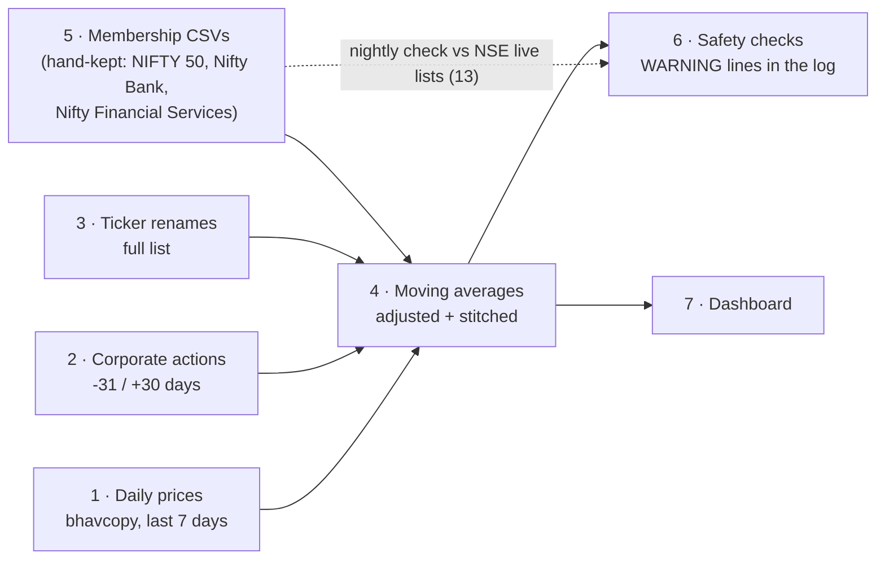

# Pipelines

Every data flow in tradeSence: what it does, where its data comes from, how it runs,
and whether it is automated. Why each one exists is in [decisions/](decisions/README.md).

## At a glance

| # | Pipeline | Source | Runs | Automated? |
|---|---|---|---|---|
| 1 | [Daily prices](#1-daily-prices) | NSE bhavcopy (free) | Nightly | ✅ Yes |
| 2 | [Corporate actions](#2-corporate-actions-splits-bonuses-demergers) | NSE corporate-actions feed (free) | Nightly | ✅ Yes |
| 3 | [Ticker renames](#3-ticker-renames) | NSE `symbolchange.csv` (free) | Nightly | ✅ Yes |
| 4 | [Moving averages](#4-moving-averages) | Pipelines 1–3 + 5 | Nightly | ✅ Yes |
| 9 | [Index closes](#9-index-closes) | NSE `ind_close_all` (free) | Nightly | ✅ Yes |
| 10 | [Delivery](#10-delivery) | NSE `MTO` delivery file (free) | Nightly | ✅ Yes |
| 11 | [Database backup](#11-database-backup) | Postgres | Nightly | ✅ Yes (this Mac + iCloud Drive) |
| 12 | [Unusual activity](#12-unusual-activity) | Pipelines 1–3 + 10 | Nightly | ✅ Yes |
| 13 | [Index member lists](#13-index-member-lists) | NSE `ind_*list.csv` (free) | Nightly | ✅ Yes |
| 14 | [Top volume](#14-top-volume) | Pipelines 1, 3, 12, 13 | Nightly | ✅ Yes |
| 15 | [Money flow](#15-money-flow) | Pipelines 1, 3, 13 | Nightly | ✅ Yes |
| 16 | [Breadth beyond the NIFTY 50](#16-breadth-beyond-the-nifty-50) | Pipelines 1, 3, 13 | Nightly | ✅ Yes |
| 5 | [Index membership (NIFTY 50, Nifty Bank, Nifty Financial Services)](#5-index-membership-nifty-50-nifty-bank-nifty-financial-services) | Hand-kept CSVs from NSE press releases | Twice a year | ⚠️ **Half**: the check is automatic, the update is manual |
| 6 | [Safety checks](#6-safety-checks) | Pipelines 1–5 | Nightly | ⚠️ **Half**: checks run automatically, but they only write to a log file and nobody is notified |
| 7 | [Dashboard](#7-dashboard) | Postgres | Every page view | ✅ Yes (but the server is started by hand) |
| 8 | [One-time setup and backfills](#8-one-time-setup-and-backfills) | Same as 1–5 | Once | ➖ Not needed |

**The nightly job** (`bun run ingest:nightly`) runs pipelines 1 → 9 → 10 → 2 → 3 → 4 → 13 → 5's check
→ 12 → 14 → 15 → 16 → 6 → 11, every weekday at **19:30 (and a 20:15 retry, decision 0033) IST**, from a launchd agent on the Mac
([decision 0001](decisions/0001-nightly-schedule-launchd.md)). Every step is safe to
re-run, and a failure in one step is logged without stopping the others.



## Automation status

| Pipeline | Automated now | Could it be fully automated? | What it would take |
|---|---|---|---|
| 1 Daily prices | ✅ | — | Done |
| 2 Corporate actions | ✅ | — | Done |
| 3 Ticker renames | ✅ | — | Done |
| 4 Moving averages | ✅ | — | Done |
| 9 Index closes | ✅ | — | Done |
| 10 Delivery | ✅ | — | Done |
| 11 Backup | ✅ | — | Done (this Mac + iCloud Drive) |
| 12 Unusual activity | ✅ | — | Done |
| 13 Index lists | ✅ | — | Done |
| 14 Top volume | ✅ | — | Done |
| 15 Money flow | ✅ | — | Done |
| 16 Breadth universes | ✅ | — | Done |
| 5 Membership | Check only | **Partly.** Detecting a change is automatic; *writing* the new rows could be too, by reading NSE's press-release PDF | A parser for the PDF. Possible, but it is only ~2 changes a year, and a wrong row would corrupt the history, so a human check is kept on purpose ([0005](decisions/0005-point-in-time-membership.md)) |
| 6 Safety checks | Runs, but silent | **Yes**: send the warnings somewhere you'll see them | TODO item 6 (nightly digest): email, Telegram or a phone notification |
| 7 Dashboard | Serves automatically | **Yes**: start the server at login, like the nightly job | A second launchd agent, or a server with a process manager once it's deployed |
| Scheduling itself | ✅ on the Mac | Needs redoing when the app moves to a server | cron or systemd on the server. **First check that NSE answers from the server's IP**; NSE blocks some cloud addresses ([0001](decisions/0001-nightly-schedule-launchd.md)) |

---

## 1. Daily prices

| | |
|---|---|
| **What** | Downloads NSE's end-of-day file for every trading day and stores every NSE equity close (the whole market, not just the 50) |
| **Source** | `nsearchives.nseindia.com` bhavcopy, in two formats (UDiFF from 2024, legacy before) |
| **Writes** | `daily_prices`, `ingest_log` |
| **Nightly** | The last 7 calendar days, **weekends included**: NSE trades on some (Budget days, Diwali Muhurat), [0007](decisions/0007-weekend-trading-sessions.md). Days already loaded are skipped without a download, so a missed night fills itself in |
| **By hand** | `bun run ingest:day <date> [--force]`, `bun run ingest:backfill <start> <end>` |
| **Code** | `src/ingest/bhavcopy.ts`, `ingest-day.ts`, `backfill.ts` |

## 2. Corporate actions (splits, bonuses, demergers)

| | |
|---|---|
| **What** | Every NSE corporate action for the whole market, with a factor so the averages aren't distorted by splits, bonuses or demergers |
| **Source** | NSE's public corporate-actions feed (one request per date range) |
| **Writes** | `corporate_actions` (~22,000 rows since 2016) |
| **Nightly** | From 31 days back (late filings) to 30 days ahead (announced splits) |
| **By hand** | `bun run ingest:corporate-actions <start> <end>` |
| **Code** | `src/ingest/corporate-actions.ts` |
| **Why** | [0002 splits](decisions/0002-split-adjusted-averages.md), [0004 demergers](decisions/0004-demerger-adjustment.md) |

## 3. Ticker renames

| | |
|---|---|
| **What** | NSE's list of every symbol change (e.g. ZOMATO → ETERNAL), so a renamed company keeps its history |
| **Source** | `nsearchives.nseindia.com/content/equities/symbolchange.csv` (1,065 renames) |
| **Writes** | `symbol_changes` |
| **Nightly** | The full list, refreshed (one small file) |
| **By hand** | `bun run ingest:symbol-changes` |
| **Code** | `src/ingest/symbol-changes.ts` |
| **Why** | [0003](decisions/0003-renamed-symbols-lose-history.md) |

## 4. Moving averages

| | |
|---|---|
| **What** | 50 SMA, 200 SMA and 200 EMA, plus each day's % move (`change_pct`, for Advance/Decline) volume vs its 20-session normal (`vol_ratio`, for the Screener) and ₹ turnover (`turnover`, for the Report Card), for every member, past and present, of every registered index (NIFTY 50, Nifty Bank and Nifty Financial Services, `src/ingest/indices.ts`; each stock once; 93 stocks, ~222k rows, ~7 s), on every day. Adjusted for splits, bonuses and demergers, and joined across renames |
| **Reads** | `daily_prices`, `corporate_actions`, `symbol_changes`, `index_members` |
| **Writes** | `daily_indicators` (~180,000 rows, 75 stocks), fully recomputed each time (~6 s) |
| **Nightly** | ✅ after pipelines 1–3; inside its own error catch, so a failure no longer skips the later steps and the backup ([0034](decisions/0034-nifty-bank-true-membership.md)) |
| **By hand** | `bun run indicators` |
| **Code** | `src/indicators/compute.ts`, `adjust.ts`, `moving-average.ts` |

## 5. Index membership (NIFTY 50, Nifty Bank, Nifty Financial Services)

| | |
|---|---|
| **What** | Who was in each tracked index on each day since 2020-01-01, so the history isn't biased toward today's winners. The indices are listed once in `src/ingest/indices.ts` ([0034](decisions/0034-nifty-bank-true-membership.md), [0037](decisions/0037-nifty-financial-services-true-membership.md)) |
| **Source** | `src/ingest/nifty50-history.csv` (12 changes since 2020) `src/ingest/niftybank-history.csv` (5 changes) and `src/ingest/niftyfinservice-history.csv` (10 changes), hand-kept from NSE Indices press releases |
| **Writes** | `index_members` (66 NIFTY 50 rows, 18 Nifty Bank rows, 31 Nifty Financial Services rows). Loading one index replaces only that index's rows, in one transaction |
| **Nightly** | **Check only**, after the index lists (13): compares each file with NSE's list downloaded that night and prints `WARNING <index> changed: NSE added …`; prints `… differs from the database` if a file was edited but not loaded; never loads anything itself |
| **By hand** | Twice a year (end of March / end of September): add the rows, then `bun run ingest:members <nifty50\|bank\|financial-services> && bun run indicators` (`ingest:nifty50` still works). Steps: [0005](decisions/0005-point-in-time-membership.md#how-to-update-it-twice-a-year-2-minutes). A new NIFTY 50 member also needs its sector in `src/lib/sectors.ts` ([0039](decisions/0039-sector-tags.md)); `tests/sectors.test.ts` fails until it has one |
| **Guard** | The loader refuses a file that breaks the index's member count on any day (NIFTY 50: 50; Nifty Bank: 12 until 2025-12-30, 14 from 2025-12-31; Nifty Financial Services: 20), and a file with fewer rows than are stored unless `--force` |
| **Code** | `src/ingest/indices.ts`, `nifty50-history.ts`, `membership-checks.ts`, `cli-members.ts` |

## 6. Safety checks

All run inside the nightly job and print a `WARNING` line to
`~/Library/Logs/tradesence-nightly.log`. **Nothing notifies you yet**; read the log, or
build TODO item 6.

| Check | Catches | Window |
|---|---|---|
| Corporate actions not updated | NSE feed down or blocked | Each run |
| Symbol changes not updated | Rename list unreachable | Each run |
| NIFTY 50 / Nifty Bank / Nifty Financial Services changed | NSE rebalanced and the CSV needs rows (or NSE's list wasn't refreshed: "could not check") | Each run |
| Membership file differs from the database | A CSV edited but not loaded with `ingest:members` | Each run |
| Indicators not recomputed | The averages step failed; the later steps still run on yesterday's averages | Each run |
| Unreadable corporate action | A split/bonus worded in a way the parser doesn't know | Last 31 days |
| Unexplained jump | A member moved >30% overnight with no corporate action (a missed split, or a real crash) | Last 31 days |
| Report Card audit | Any Report Card number that differs from an independent recalculation from raw prices (`src/audit/report-card.ts`, [0013](decisions/0013-independent-audit-and-rounding.md)), for every card: each registered index's members on the session, with that index's peers ([0035](decisions/0035-nifty-bank-report-cards-and-signals.md), [0037](decisions/0037-nifty-financial-services-true-membership.md); 84 cards, ~8 s); one line per mismatch, first 10 listed. A crashed audit is a warning too | Latest session, each run |
| Backup failed / iCloud copy stopped | `pg_dump` failure, or iCloud stalling or full ([0021](decisions/0021-database-health-and-delivery.md)) | Each run |

Also, failed price downloads are stored as `error` and retried the next night, and a day
that looks like a holiday is re-checked for 2 days in case NSE was just late.

## 7. Dashboard

| | |
|---|---|
| **What** | `/` Breadth, `/advance-decline`, `/crossings`, `/screener`, `/stock/[symbol]` (Report Card) and `/learn` (glossary), queried live from Postgres on every page view |
| **Run** | Development: `bun run dev`. Production: `bun run build && bun run start` (port 3000) |
| **Automated?** | Pages always show the latest data, but the server is started by hand and stops when the Mac restarts |
| **Needs** | Postgres running (`brew services start postgresql@14`, starts at login) |

## 9. Index closes

| | |
|---|---|
| **What** | Daily open/high/low/close of **every** NSE index (NIFTY 50, Next 50, 500, sector indices…) |
| **Source** | `nsearchives.nseindia.com/content/indices/ind_close_all_DDMMYYYY.csv`, the same archive as bhavcopy |
| **Writes** | `index_prices` (~185,000 rows since 2020) |
| **Nightly** | ✅ The same 7-day window, but only days pipeline 1 confirmed as trading days (so no second set of holiday rules) |
| **By hand** | `bun run ingest:indices <start> <end>` (resumable; failed days are retried) |
| **Used by** | The forward-return study ([research 0001](research/0001-does-breadth-predict.md)), and later the divergence signal (TODO item 4) |
| **Code** | `src/ingest/index-prices.ts` |
| **Checked** | Month-end NIFTY 50 closes match TradingView exactly (7 of 7 checked) |
| **Why** | [0006](decisions/0006-nifty50-index-closes.md) (source choice, and NSE's month-first dates) |

## 10. Delivery

| | |
|---|---|
| **What** | Shares traded and shares actually delivered (bought and kept, not squared off the same day), per stock per day. Delivery % = delivered ÷ traded |
| **Source** | `nsearchives.nseindia.com/archives/equities/mto/MTO_DDMMYYYY.DAT`, the same archive as bhavcopy; one format since at least 2012 |
| **Writes** | `daily_delivery` (EQ only: NSE leaves out BE, which is always 100% delivered), since 28 Sep 2016 |
| **Nightly** | ✅ The same 7-day window, only days pipeline 1 confirmed as trading days |
| **By hand** | `bun run ingest:delivery <start> <end>` (resumable; failed days are retried) |
| **Used by** | Nothing yet: the delivery study comes first (TODO) |
| **Code** | `src/ingest/delivery.ts` |
| **Checked** | Traded quantity equals bhavcopy volume exactly (INFY 1 Oct 2026, 20MICRONS 28 Sep 2016) |
| **Why** | [0021](decisions/0021-database-health-and-delivery.md) (own table, not columns on prices; quantities, not the rounded %) |

## 11. Database backup

| | |
|---|---|
| **What** | A compressed copy of the whole database (`pg_dump`), newest 7 kept |
| **Where** | `~/Backups/tradesence` (newest 7) and iCloud Drive `Backups/tradesence` (newest 3). Override with `TRADESENCE_BACKUP_DIR` / `TRADESENCE_BACKUP_MIRROR` |
| **Nightly** | ✅ Last step of the nightly job; a failure is a `WARNING` line and changes nothing |
| **By hand** | `bun run db:backup`. Restore: `createdb tradesence_restore && pg_restore -d tradesence_restore <file>` |
| **Code** | `ops/backup.sh` |
| **Checked** | A restore into a scratch database matched every table's row count (4 Oct 2026). Run under the real launchd job: local copy ✅, iCloud copy ✅, deleting old iCloud copies blocked by macOS (10-minute limit and a 1.2 GB cap keep that safe; [0021](decisions/0021-database-health-and-delivery.md)) |
| **Why** | [0021](decisions/0021-database-health-and-delivery.md) |

## 12. Unusual activity

| | |
|---|---|
| **What** | Each session's unusual stock-days: big keeping (delivered ≥ 5× normal), huge volume (traded ≥ 5× normal), delivery jump / collapse (delivery % ±30 points from normal), normal = the stock's last 20 sessions |
| **Source** | `daily_prices` + `daily_delivery`, through `loadAdjustedHistory` (splits, renames); companies trading ≥ ₹1 crore a day, ETFs out |
| **Writes** | `unusual_days`, replaced in full in one transaction (~84,000 rows since 27 Oct 2016; ~47 a day lately) |
| **Nightly** | ✅ After the averages, ~21 s; first tops up `fund_symbols` from the session's bhavcopy (ISIN "INF…") so new ETFs stay out. A failure is a `WARNING` and the old table stays |
| **By hand** | `bun run activity` |
| **Used by** | `/activity` and the Report Card's "Unusual days" card |
| **Code** | `src/indicators/activity.ts`, `compute-activity.ts`, `universe.ts`; `src/query/activity.ts` |
| **Why** | [0024](decisions/0024-unusual-activity.md) |

## 13. Index member lists

| | |
|---|---|
| **What** | Today's members of 43 NSE indices (15 broad, 17 sector, 11 theme), each with NSE's sector (`Industry`) |
| **Source** | `nsearchives.nseindia.com/content/indices/ind_*list.csv` (`INDEX_LISTS` in `src/ingest/index-constituents.ts` holds each file name) |
| **Writes** | `index_constituents`, replaced per index; a failed or empty download keeps yesterday's members and logs a `WARNING` |
| **Checks** | Every Nifty Total Market stock in exactly one size list (Nifty 100 / Midcap 150 / Smallcap 250 / Microcap 250), else a `WARNING` |
| **Nightly** | ✅ ~15 s |
| **By hand** | `bun run ingest:index-lists` |
| **Why** | [0025](decisions/0025-top-volume.md) |

## 14. Top volume

| | |
|---|---|
| **What** | Per Nifty Total Market stock and window (last 1/5/21/63/126 market sessions): ₹ traded, split-adjusted shares, price move, Unusual activity days |
| **Writes** | `volume_leaders`, replaced in one transaction (~3,700 rows) |
| **Nightly** | ✅ After Unusual activity, ~5 s |
| **By hand** | `bun run volume-leaders` |
| **Used by** | `/volume` |
| **Code** | `src/indicators/volume-leaders.ts`, `compute-volume-leaders.ts`; `src/query/volume.ts` |
| **Why** | [0025](decisions/0025-top-volume.md) |

## 15. Money flow

| | |
|---|---|
| **What** | Per Nifty Total Market stock and window (last 1/5/21 market sessions): ₹ traded, its normal ₹ per session over the 63 sessions before the window (needs 40 traded), price move, NSE sector (the page sums per sector). Plus each sector's 1-week reading for the last 52 weeks, and short special sessions (market-wide ₹ under half usual) |
| **Writes** | `money_flow` (~2,250 rows), `sector_flow_weeks` (~1,000), `short_sessions` (a few), replaced together in one transaction; then `ANALYZE` of every table rebuilt nightly |
| **Nightly** | ✅ After Top volume, ~10 s |
| **By hand** | `bun run money-flow` |
| **Used by** | `/money-flow` |
| **Code** | `src/indicators/money-flow.ts`, `compute-money-flow.ts`; `src/query/money-flow.ts` |
| **Why** | [0028](decisions/0028-money-flow.md), [0029](decisions/0029-money-flow-history-and-db-tidy.md) |

## 16. Breadth beyond the NIFTY 50

| | |
|---|---|
| **What** | Share of stocks above their 50/200-day SMA and 200-day EMA: the whole liquid market (companies with median turnover ≥ ₹1 crore over 20 sessions, ETFs out) on every day since 2016; each NSE index list (today's members) on the latest session |
| **Writes** | `breadth_daily`, by upsert only (never deletes): whole-market rows recomputed nightly, one new row per index list and average each night |
| **Nightly** | ✅ After Money flow, ~1–2 min (loads every company's history) |
| **By hand** | `bun run breadth` |
| **Used by** | `/` (Breadth page selector) |
| **Code** | `src/indicators/averages.ts`, `breadth-universes.ts`, `compute-breadth.ts` |
| **Why** | [0030](decisions/0030-breadth-universes.md) |

## 8. One-time setup and backfills

Run once on a new machine (full list in the [README](../README.md#setup)):

```bash
psql tradesence -f ops/postgres-tuning.sql && brew services restart postgresql@14
bun run db:migrate
bun run ingest:backfill 2016-09-28 <today>      # prices, ~28 min, resumable
bun run ingest:corporate-actions 2016-01-01 <today+30d>
bun run ingest:symbol-changes
bun run ingest:indices 2020-01-01 <today>        # index closes, ~12 min
bun run ingest:delivery 2016-09-28 <today>       # delivery figures, resumable
bun run ingest:nifty50
bun run indicators
bun run activity                                  # unusual activity table, ~20 s
bun run ingest:index-lists                        # NSE index members, ~15 s
bun run volume-leaders                            # top volume table, ~5 s
./ops/install-nightly.sh                         # schedule the nightly job
```
